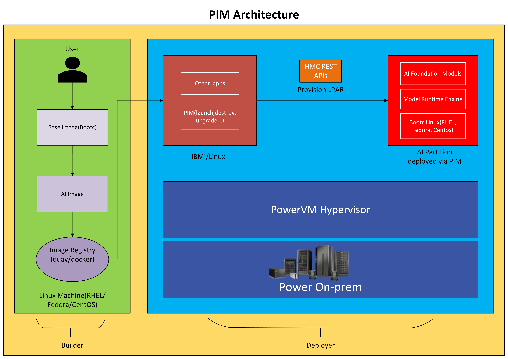

# Power Inference Microservices (PIM)

PIM enables installation of AI environment with minimal steps on IBM core environments like IBMi, AIX or Linux managed by HMC. PIM solution leverages [bootable containers(bootc)](https://docs.fedoraproject.org/en-US/bootc/), a modern tool for deploying and configuring immutable linux systems.

PIM provides end-to-end solution for AI stack installation by logical partition creation, network and storage attachment and boots partition with specified AI stack image in the configuration.



## Key highlights of PIM solution
- Seamless Update: Systems updates are automatic if newer version of the image is publically available. Otherwise, when user upgrades via PIM [upgrade commmand](docs/deployer-guide.md#upgrade) with the latest credentials the system updates are pulled and applied from the configured private registry over a reboot of the system.
- Rollback: bootc preserves state of the system. In case of disruption in Updates, system can be rolled back to previous version.
- Makes admin's management simple by easing day 2 operations like monitor, upgrade and manage.
- Provides end-to-end software lifecycle management operations like [launch](docs/deployer-guide.md#launch), [destroy](docs/deployer-guide.md#destroy), [update-config](docs/deployer-guide.md#update-config), [update-compute](docs/deployer-guide.md#update-config), [rollback](docs/deployer-guide.md#rollback) and [status](docs/deployer-guide.md#status)
- Provides AI inferencing capability on CPU currently. Aim to provide inferencing based on AI accelerator in future.
- PIM currently supports IBMi and Linux OS environments. AIX OS will be supported later.

## PIM Personas
PIM has 2 personas namely builder and deployer.
- **Builder:** Someone who builds bootable AI container image to bringup the AI stack with the deployer flow. Refer [builder-guide.md](docs/builder-guide.md) for more details.
- **Deployer:** Someone who deploys PIM solution to bring up the AI stack in IBM core environments. Refer [deployer-guide.md](docs/deployer-guide.md) for more details.

## Getting started
To get started, you can follow below steps to build and deploy a simple entity extraction application which uses vLLM to do entity extraction via LLM inferencing.
- **Step 1: Build application**
    - ***vLLM:***
        - Open source [vLLM](https://github.com/vllm-project/vllm) application can be used.
    - ***Entity Extraction App:***
        - Sample entity extraction application is provided [here](examples/simple-entity-extraction/app/entity.py) that uses OpenAI API to call `/chat/completion` API to do entity extraction.
- **Step 2: Containarize the application**
    - ***vLLM:***
        - Follow [this](examples/vllm/app/README.md) README to build the vLLM application's container image. It has a script that pulls open source vLLM code base and builds container image out of it.
    - ***Entity Extraction App:***
        - [README](examples/simple-entity-extraction/app/README.md) for steps to build the container image of entity extraction application.
- **Step 3: Build Base image**
    - Follow base image building steps given [here](base-image/README.md)
- **Step 4: Build AI image**
    - ***vLLM:***
        - Follow steps given [here](examples/vllm/README.md) to build the vLLM AI image, ensure to use the image created in `step-3` as base image(FROM).
    - ***Entity Extraction App:***
        - Scripts and README to build AI image is given [here](examples/simple-entity-extraction/README.md), ensure to use the vLLM AI image created in last step as base image(FROM) here.
- **Step 5: Setup PIM**
    - You can follow steps to setup PIM on your IBMi/Linux machine given [here](docs/deployer-guide.md#installation)
- **Step 6: Fill config.ini**
    - Read through this [guide](docs/configuration-guide.md) and fill appropriate values and use final image built on step-4 in `ai.image` field.
- **Step 7: Run Launch**
    ```
    python cli/pim.py launch
    ```

## Supported Versions
Below are the minimum supported versions of critical components of PIM

| Component                                    |           P10           |             P11           |
| -------------------------------------------- | ----------------------- | ------------------------- |
| Host Management Console(HMC)                 | 1061                    | 1110                      |
| Partition Firmware(PFW)                      | 1050                    | 1110                      |
| Virtual IO Server(VIOS)                      | 4.1.1.0                 | 4.1.1.00                  |
| IBMi                                         | 7.5                     | 7.6                       |
