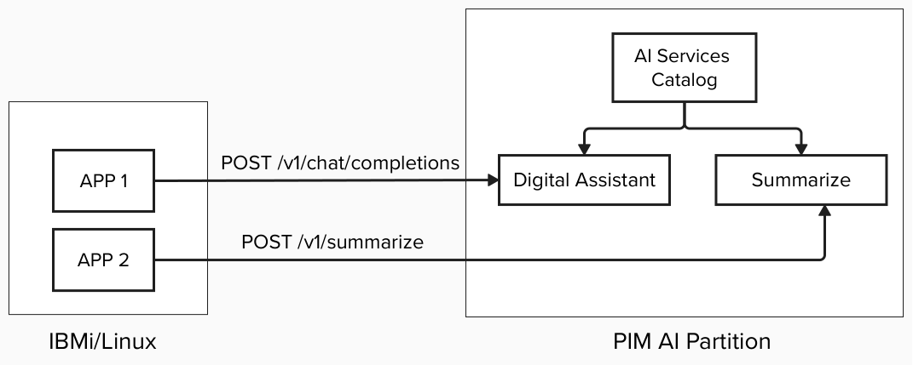

# AIS

The AIS example demonstrates how to deploy AI Services on a PowerVM partition, enabling you to run AI workloads in your on-premises environment.

> **Important:** AI Services runs only on **RHEL**. You must use a RHEL-based bootc image and PIM Bootc Image built on top of RHEL. A valid **Red Hat subscription** is required — provide your Red Hat credentials via `rhsmUsername` and `rhsmPassword` in `config-json` so the partition can register with the Red Hat Subscription Manager at boot time.

## Architecture


## Steps to setup e2e flow

### Step 1: Preparing the images

##### PIM Bootc Image

- Bootc image to bring up the AI partition that can run the AI Services application.
- Must be based on a RHEL bootc image. Follow the steps below to build one.

#### Build from source

##### Step 1: Build PIM Base image

Follow the steps provided [here](../../base-image) to build the RHEL base image. Make sure to use rhel-bootc image instead of fedora as AI Services runs only on RHEL.

##### Step 2: Build PIM Bootc image

Update the `FROM` line in the [Containerfile](../ais/Containerfile) to reference the RHEL-based PIM base image built in the previous step, then build the PIM bootc image:

```shell
podman build -t <your-registry>/pim:ais .
```

The ai-services binary will be built or downloaded at runtime based on the configuration in your config.ini file (see Configuration Parameters below).

##### Step 3: Push the image

```shell
podman push <your-registry>/pim:ais
```

### Step 2: Setting up PIM partition

Follow this [deployer guide](../../docs/deployer-guide.md) to setup PIM cli, configuring your AI partition and launching it.

## Configuration Parameters

The AIS example supports the following configuration parameters in your PIM config file:

#### release

- Specifies the AI Services version to use (default: `main`)
- Set to `main` to build from the latest source code
- Set to a specific version tag (e.g., `v0.3.0`) to download a pre-built binary from GitHub releases

#### adminPassword

- Admin password for AI Services catalog (default: `admin123`)
- Used during the catalog configuration step

> **Note:** An active Red Hat subscription is required. AI Services rely on Podman, which is installed during bootstrap via `dnf` from Red Hat repositories that are restricted to registered RHEL systems.

#### rhsmUsername

- Red Hat Subscription Manager username
- Required for RHEL bootc images to register the partition with Red Hat

#### rhsmPassword

- Red Hat Subscription Manager password
- Required for RHEL bootc images to register the partition with Red Hat

**Sample config:**

```ini
[ai]
  # PIM Bootc Image with ai-services
  image = "quay.io/powercloud/pim:ais"
  config-json = """
    {
          "release": "v0.3.0",
          "adminPassword": "your-secure-password",
          "rhsmUsername": "your-redhat-username",
          "rhsmPassword": "your-redhat-password"
    }
    """
  auth-json = """{"auths": {"icr.io" : {"auth": "<base64 encoded token>"}}}"""
  # provide API details of your AI application if you want to verify it at the end of PIM partition deployment via launch flow
  [[validation]]
    # yes, no - set yes to make the request to validate the AI app deployed as part of PIM partition
    request = "yes"
    url = "https://catalog-api.<partition_ip>.nip.io/health"
    method = "GET" # GET, POST
    # provide headers to use in json format inside triple quotes
    headers = """
    {
      "Content-Type": "application/json"
    }
    """
    payload = """"""
    # true, false - set false to skip SSL certificate verification
    verify-ssl = false
```

## How It Works

The AIS setup uses a bootc-based architecture:

1. **PIM Bootc Image**:
   - Includes all necessary configuration scripts and systemd services
   - Contains build tools (git, make, golang) and download tools (curl)
   - Uses immutable ostree-based filesystem

2. **System-level setup** (`ais_config.service`):
   - Runs at partition boot time as a oneshot service
   - Acquires ai-services binary based on config.ini settings:
     - **Build method**: Clones repository and builds from source
     - **Download method**: Downloads pre-built binary from GitHub releases
   - Executes `ai-services bootstrap --runtime podman`
   - Configures AI Services catalog with admin credentials
   - Waits for all 3 layers of catalog deployment to complete
   - Depends on: `base_config.service`, `network-online.target`, `cloud-config.target`

## Architecture Flow

```
Boot → ais_config.service (oneshot)
       ├─ Acquire ai-services binary (build from source OR download from release)
       ├─ Register with Red Hat Subscription Manager (if rhsmUsername/rhsmPassword set)
       ├─ Run: bootstrap --runtime podman
       ├─ Setup Podman authentication
       └─ Run: catalog configure --runtime podman
              ├─ Layer 1: Secrets (catalog-secret, catalog-db-secret, auth-secret)
              ├─ Layer 2: Infrastructure (catalog-db, caddy)
              └─ Layer 3: Application (catalog-backend, catalog-ui)
```

**Key Features:**

- ai-services binary is acquired at runtime based on config.ini settings
- Supports both building from source and downloading from releases
- Flexible configuration allows switching between build methods without rebuilding the image
- Immutable filesystem ensures consistency and reliability
- All configuration happens through systemd services
- Catalog pods (backend, UI, database) provide the AI Services functionality
